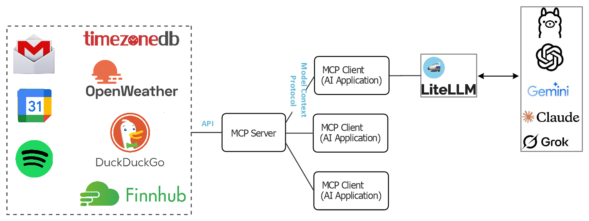

# Locally Hosted MCP Server

This repository hosts a Model Context Protocol (MCP) server that exposes several data/services as tools to compatible MCP clients. Running your own MCP server locally provides several advantages:

- **Privacy and Security**: API keys, credentials, and requests remain entirely on your machine or network. This eliminates the risk of leaking sensitive tokens to external MCP providers or intermediaries and ensures your data is not logged or analyzed by third parties.

- **Observability and Debugging**: Local control makes it easy to add logging, performance monitoring, or debugging hooks. You can inspect raw inputs and outputs, trace tool usage by LLMs, and fine-tune behavior for your specific use case.

- **Educational and Experimental Use**: Hosting your own server allows you to learn how LLMs interact with tools under the MCP standard. It's ideal for debugging tool-chaining, testing new APIs, building LLM agents, or running offline experiments without relying on third-party infrastructure. You can modify or extend the server to include custom tools, mock endpoints, or sandboxed APIs tailored to your projects. This is especially valuable for rapid prototyping, home labs, and developer-focused research.

For background on the MCP protocol, see [MCP.md](MCP.md).

## System Architecture



Tools exposed by this MCP server:

- Time Zone (`TimeZoneDB`): This tool provides accurate time zone information based on a specified location. It supports lookups by city name, time zone identifier, or geographic coordinates (latitude/longitude). The response includes current local time, UTC offset, daylight saving time (DST) status, and the zone's abbreviation. It enables LLMs and agents to reason about time-aware operations across regions and is backed by the TimeZoneDB API for reliable global coverage.

- Weather (`OpenWeatherMap`): This tool offers comprehensive weather data, including current conditions, hourly forecasts, and daily forecasts, by leveraging OpenWeatherMap’s One Call 3.0 API. Users can retrieve temperature, humidity, wind, cloud coverage, precipitation probability, and UV index for a given location, with support for multiple units (imperial, metric). The data is normalized into LLM-friendly summaries while retaining structured fields, making it suitable for conversational interfaces and analytical use.

- Stocks/Market Data (`Finnhub`): This tool delivers real-time and historical financial data via the Finnhub API. It includes support for stock quotes, company profiles, financial statements, news, market status, holidays, and peer comparisons. The tool is designed to answer investment-related questions such as "What is the stock price of Apple?" with concise summaries and structured JSON payloads. It is ideal for personal finance agents, dashboards, or assistant workflows with financial awareness.

- Web Search (`DuckDuckGo`): This tool enables lightweight web search by querying DuckDuckGo's Instant Answer API to fetch real-time search results. It is useful for handling general knowledge queries not covered by internal tools or APIs. The returned results include page titles, content snippets, and source URLs, providing agents with grounded answers and users with credible references. DuckDuckGo is privacy-focused and does not track queries, making it a reliable and safe fallback source.

## Rate Limitting

External APIs such as OpenWeatherMap, Finnhub, and TimeZoneDB typically enforce strict usage quotas (e.g., requests per minute or per day) to protect their infrastructure from abuse and ensure fair usage among clients. Without safeguards, a burst of requests (intentional or accidental) could lead to bans, temporary blacklisting, or degraded service. To mitigate this, the MCP server implements server-side rate limiting. Our implementation uses Redis sorted sets (`ZSET`) to implement a sliding window rate limiter. Here's how it operates:

- Each incoming request is recorded with its epoch timestamp as both the value and score in a Redis sorted set. The Redis key is structured as `rate:<tool_name>:<user_id>`.

- When a new request is made, the rate limiter first removes outdated entries from Redis that fall outside the configured time window (interval_seconds) using `ZREMRANGEBYSCORE`. It then checks how many requests remain within the valid window using `ZCARD`. If the number exceeds the allowed threshold (max_requests), it calculates the remaining wait time by examining the oldest request timestamp and pauses execution until the window clears. If the request is within limits, it logs the current request timestamp into Redis using `ZADD`, ensuring accurate tracking for future rate checks.

## Monitoring

Monitoring your MCP server is essential to ensure reliability, maintain performance, and proactively detect issues in real-time. A well-monitored MCP setup gives visibility into tool usage, latency, failure rates, and external API behavior enabling faster debugging and better resource planning. These metrics can be pushed to a time-series database like InfluxDB, enabling historical tracking and visualization through dashboards such as Grafana.

In this project, we implement monitoring by wrapping each tool function with a custom instrument decorator that records invocation metadata. This wrapper captures the tool name, invocation timestamp, execution duration, and relevant request parameters, then sends this information to InfluxDB. We include tags such as hostname, username, and tool name to support rich filtering in dashboards or queries. This approach enables lightweight, real-time observability across all tools served by the MCP server without modifying the core tool logic.


## Demo

### Start MCP Server

Navigate to the server directory:

    cd <project-root>/server

Start Redis (used for rate limiting and state tracking):

    docker compose up -d

Create a `.env` file in the same directory and provide valid API keys for external services:

    FINNHUB_API_KEY=your_finnhub_key
    TimeZoneDB_API_KEY=your_timezone_key
    OpenWeather_API_KEY=your_openweather_key

Start the MCP server:

    python3 main.py

This will launch the MCP server, which exposes tool-based APIs to compatible clients.

### Run MCP Client

To run the example client, which demonstrates how an LLM can invoke one or more tools to answer natural language questions:

    cd <project-root>/client
    python3 main.py

The client sends a series of queries to the LLM. In turn, the LLM utilizes relevant tools from the MCP server to construct informed responses. Below is a sample output from the client run:

```text
================================================================================
[User Question] What is the time in Walnut Creek, CA?
================================================================================

[Final Answer] The current local time in Walnut Creek, California is 2:07 PM (PDT) on August 4, 2025.

================================================================================
[User Question] What is the time zone in Walnut Creek, CA?
================================================================================

[Final Answer] Walnut Creek, located in California, operates in the Pacific Time Zone.
The time zone is called "America/Los_Angeles," and currently, it observes Pacific Daylight Time (PDT) with a GMT offset of -25200 seconds.
Daylight Saving Time (DST) is active (indicated by dst = '1'), and the next time change will transition to Pacific Standard Time (PST).

================================================================================
[User Question] what's the timezone in Berlin?
================================================================================

[Final Answer] The current time zone in Berlin, Germany is Central European Summer Time (CEST), with an offset of UTC+2 hours.
Daylight Saving Time (DST) is currently active. The next change will be to Central European Time (CET).

================================================================================
[User Question] What is the current weather in Walnut Creek, CA ?
================================================================================

[Final Answer] The current weather in Walnut Creek, CA is as follows:

- **Conditions**: Clear sky
- **Temperature**: 64°F (Feels like 63.25°F)
- **Min/Max Temperature**: 59.43°F / 67.05°F
- **Humidity**: 67%
- **Pressure**: 1015 hPa
- **Wind**: 8.99 m/s from 100° with gusts up to 18.01 m/s

It's a clear day with a comfortable temperature.

================================================================================
[User Question] Get the current quote for Cisco Systems.
================================================================================

[Final Answer] The current stock quote for Cisco Systems (CSCO) is as follows:

- **Current Price**: $68.49
- **Change**: +$1.38 (+2.06%)
- **Open**: $67.77
- **High**: $68.51
- **Low**: $67.61
- **Previous Close**: $67.11

These values are based on the latest update.

================================================================================
[User Question] Get company news for Cisco Systems from 2025-01-01 to 2025-04-01
================================================================================

[Final Answer] Here are some recent news articles related to Cisco Systems (CSCO) from January 1, 2025, to April 1, 2025:

1. **Cisco Systems, Inc. (CSCO) Optics & Optical Fireside Chat at OFC 2025 Conference - (Transcript)**
   - **Summary**: Cisco Systems, Inc. discussed optics and optical topics at the OFC 2025 conference.
   - **Source**: [SeekingAlpha](https://finnhub.io/api/news?id=699aeaf256cd74ac011f55383f6c3c43e4d1a12571a82fc2afc4a6da99a0f0a6)
   - **Date**: April 1, 2025

2. **Can ANET Stock Revive its Growth Momentum After the Sudden Slide?**
   - **Summary**: Discussion on ANET's potential for growth momentum driven by robust demand trends.
   - **Source**: [Yahoo](https://finnhub.io/api/news?id=1f9e64c9dd7a1d64535c5d61ddba43decf19fc9841e7558e742fdd315278734b)
   - **Date**: April 1, 2025

3. **Dogs Of The Dow Chase April's 'Safer' Buy**
   - **Source**: [SeekingAlpha](https://finnhub.io/api/news?id=2feed9044f044f2d4cb8422e3537e5db1ce869843f4c4367a375d4fa0a997d66)
   - **Date**: April 1, 2025

For more detailed information, you can follow the links provided to the full articles.

================================================================================
[User Question] What is ticker symbol for microsoft?
================================================================================

[Final Answer] The ticker symbol for Microsoft is MSFT.

================================================================================
[User Question] What are the top stock exchanges?
================================================================================

[Final Answer] The top stock exchanges in the world, ranked by market capitalization and influence, typically include:

1. **New York Stock Exchange (NYSE)**: Located in the United States, it's the largest stock exchange in the world by market capitalization of its listed companies.

2. **Nasdaq**: Also based in the United States, Nasdaq is known for its high-tech and internet-based companies.

3. **Tokyo Stock Exchange (TSE)**: The largest stock exchange in Japan and one of the biggest in Asia.

4. **Shanghai Stock Exchange (SSE)**: One of the largest stock exchanges in China, it is known for trading in stocks and bonds.

5. **Hong Kong Stock Exchange (HKEX)**: A major global platform for raising capital, it plays a crucial role in connecting Chinese companies with international investors.

6. **Euronext**: A pan-European stock exchange, with locations in Amsterdam, Brussels, Dublin, Lisbon, Milan, Oslo, and Paris.

7. **London Stock Exchange (LSE)**: One of the oldest stock exchanges in the world, it is a major financial hub in Europe.

8. **Shenzhen Stock Exchange (SZSE)**: Another major exchange in China, focusing on manufacturing and technology companies.

9. **Toronto Stock Exchange (TSX)**: The largest stock exchange in Canada, known for its mining and energy sectors.

10. **Bombay Stock Exchange (BSE)** and **National Stock Exchange (NSE)**: Both are major stock exchanges in India, with NSE being larger in terms of trading volume.

These exchanges play significant roles in the global financial market, hosting the shares of many of the world's most well-known and valuable companies.

================================================================================
[User Question] Is US stock market open now?
================================================================================

[Final Answer] The US stock market is currently closed.

================================================================================
[User Question] What are holidays for US stock market?
================================================================================

[Final Answer] Here are the upcoming and past holidays for the US stock market:

### Upcoming Holidays:
- Christmas Day: December 25, 2026
- Thanksgiving Day: November 27, 2026
- Labor Day: September 7, 2026
- Independence Day: July 3, 2026
- Juneteenth: June 19, 2026
- Memorial Day: May 25, 2026
- Good Friday: April 3, 2026
- Washington's Birthday: February 16, 2026
- Birthday of Martin Luther King, Jr: January 19, 2026
- New Year's Day: January 1, 2026

### Recent Holidays:
- Christmas Day: December 25, 2025
- Thanksgiving Day: November 28, 2025
- Labor Day: September 1, 2025
- Independence Day: July 4, 2025
- Juneteenth: June 19, 2025
- Memorial Day: May 26, 2025
- Good Friday: April 18, 2025
- Washington's Birthday: February 17, 2025
- Birthday of Martin Luther King, Jr: January 20, 2025
- New Year's Day: January 1, 2025

### Holidays for 2024:
- Christmas Day: December 25
- Thanksgiving Day: November 28
- Labor Day: September 2
- Independence Day: July 4
- Juneteenth: June 19
- Memorial Day: May 27
- Good Friday: March 29
- Washington's Birthday: February 19
- Birthday of Martin Luther King, Jr: January 15
- New Year's Day: January 1

These holidays represent days when the US stock market will be closed.

================================================================================
[User Question] What's the current market cap of NVIDIA?
================================================================================

[Final Answer] The current market capitalization of NVIDIA (symbol: NVDA) is approximately $4,238.768 billion.

================================================================================
[User Question] Compare NVIDIA stock price with Apple.
================================================================================

[Final Answer] Here's the comparison of NVIDIA and Apple stock prices as of August 4, 2025:

### NVIDIA (NVDA):
- **Current Price:** $180
- **Change:** +$6.28 (3.615%)
- **Open:** $175.16
- **High:** $180.2
- **Low:** $174.52
- **Previous Close:** $173.72

### Apple (AAPL):
- **Current Price:** $203.35
- **Change:** +$0.97 (0.4793%)
- **Open:** $204.505
- **High:** $207.88
- **Low:** $201.675
- **Previous Close:** $202.38

NVIDIA is experiencing a higher percentage change in price today compared to Apple.

================================================================================
[User Question] Who owns SpaceX?
================================================================================

[Final Answer] SpaceX is a private company, and its ownership is held by a combination of Elon Musk and several institutional and private investors.
Elon Musk, the founder and CEO, is known to be the largest shareholder, with his stake providing him substantial control over the company.
Other investors include venture capital firms and private equity entities which have invested in the company over the years.
However, as SpaceX is privately held, detailed ownership percentages and structures are not publicly disclosed.
```

